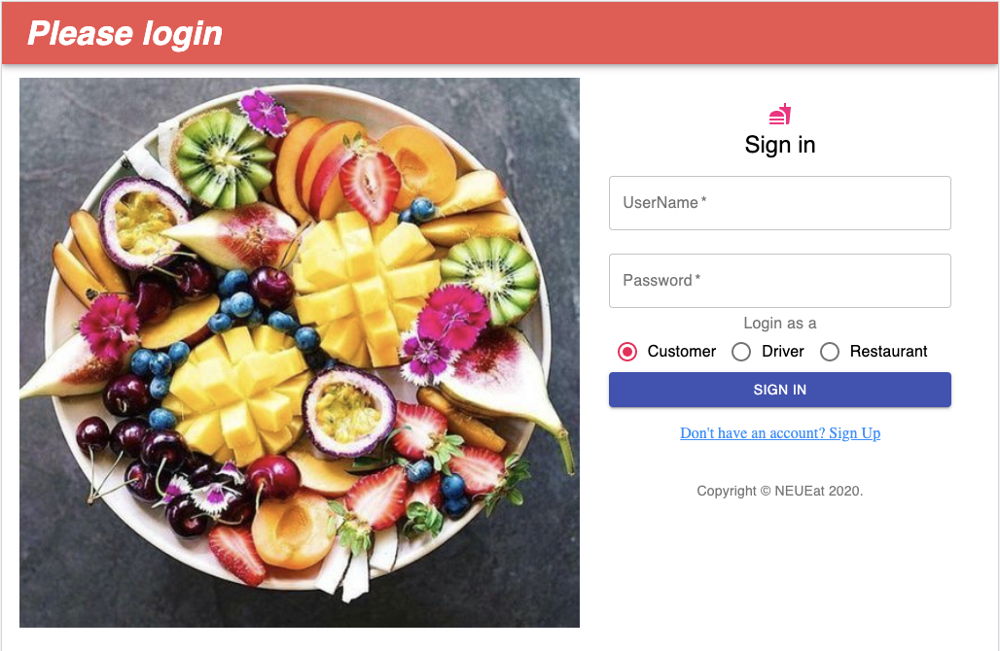
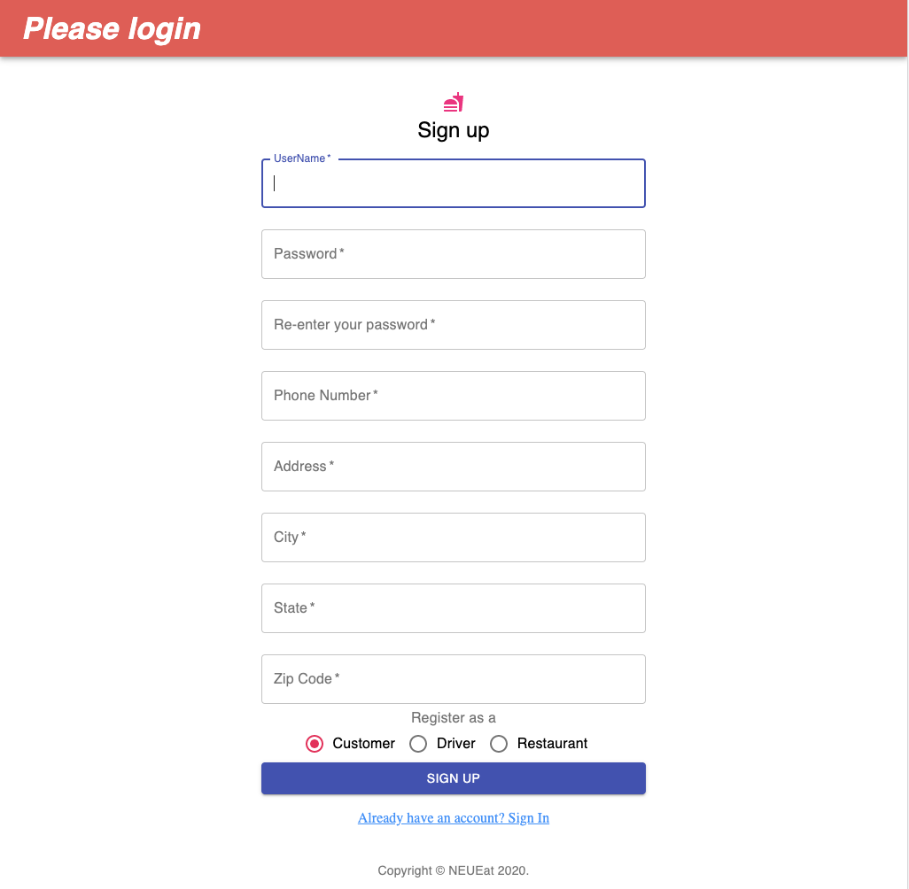
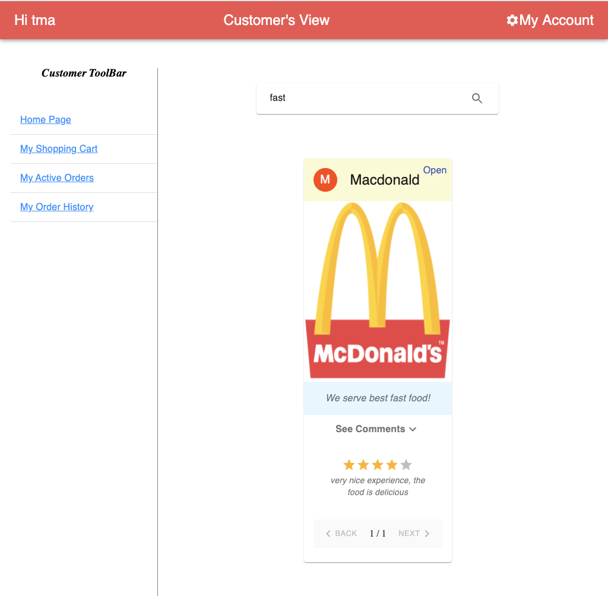
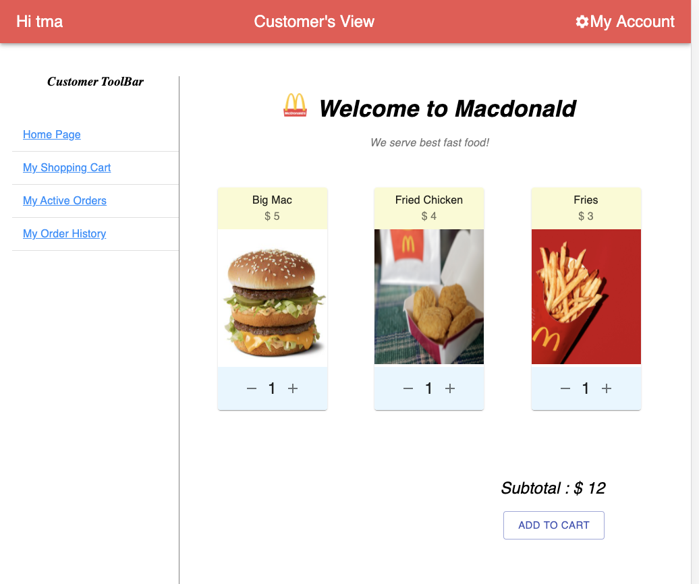
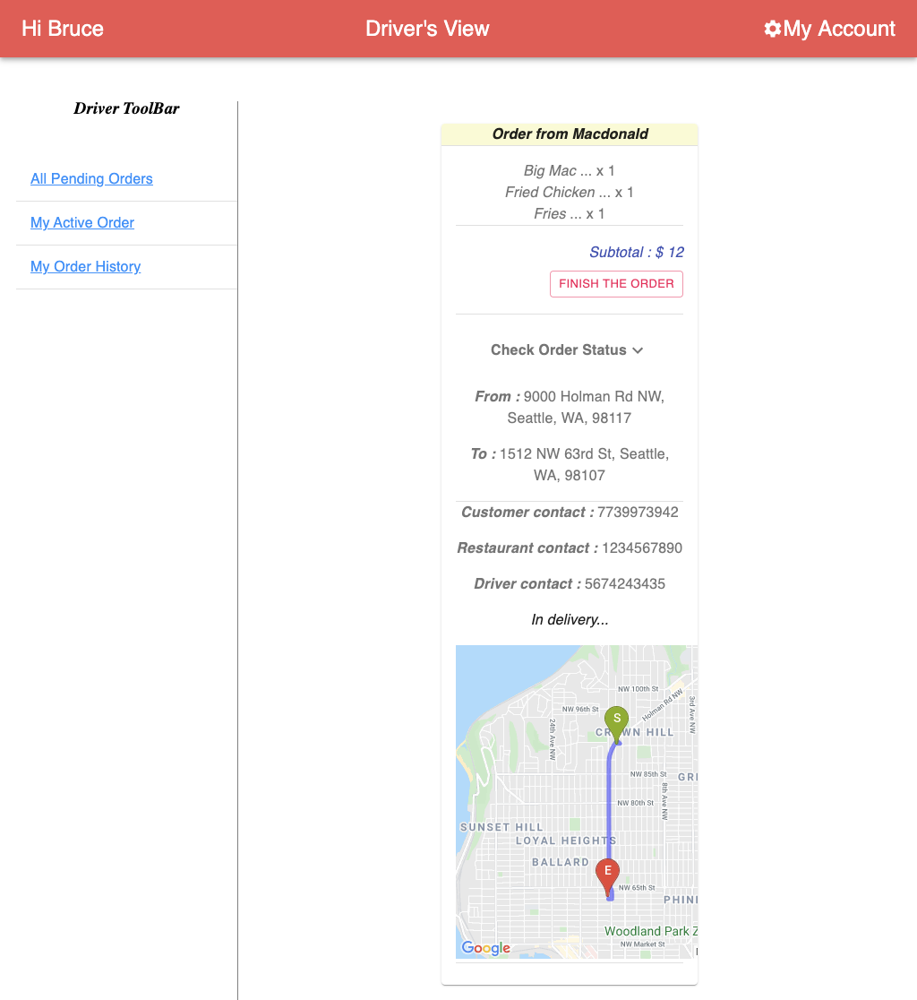
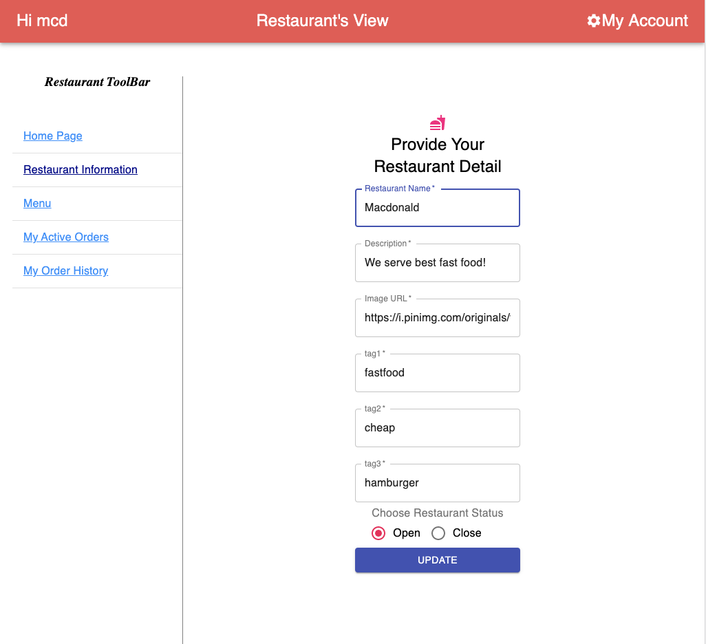
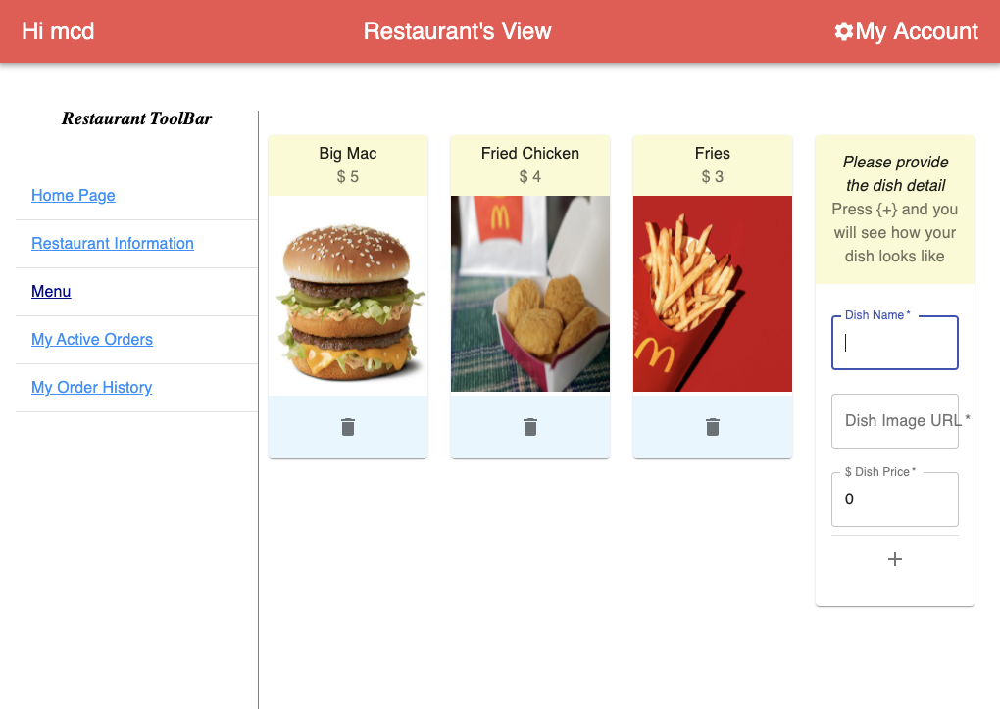
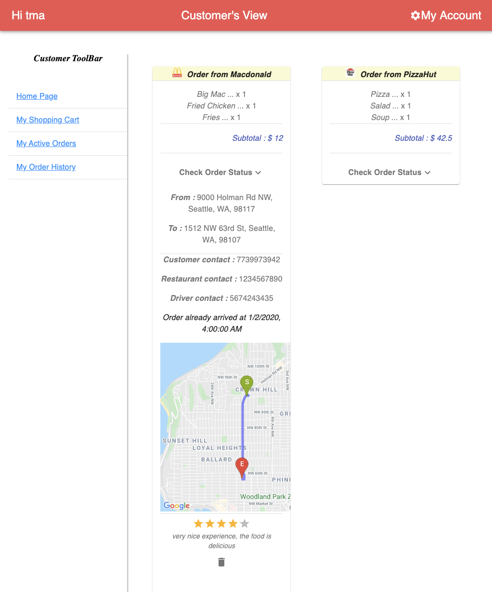

# foodDeliverApp
This is a Food Deliver Application using Springboot + React + MongoDB. The app is deployed on Heroku : https://neu-eat.herokuapp.com/

The App enables users to simulate among customer, driver and restaurant in a food delivery system.

Login Page

Register Page

Customer Search for Restaurant or Food

Customer Place Order

Driver Accept/Finish the Order

Restaurant Edit Information

Restaurant Add or Delete Menu

Customer Add or Delete Comment & Rating

